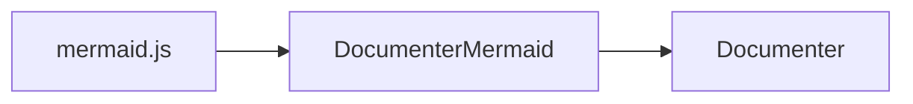
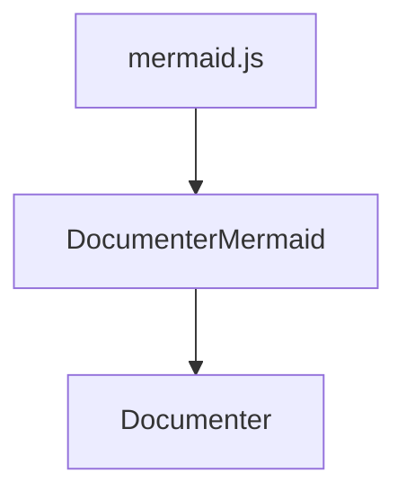

# DocumenterMermaid

A [Documenter](https://github.com/JuliaDocs/Documenter.jl) plugin package allows for the inclusion of [mermaid.js](https://mermaid.js.org/) diagrams in HTML documents:



The above diagram can be included by using the standard Mermaid Markdown syntax:

````markdocs

````

To enable the package, simply load it in the `make.jl` script.
Any code blocks tagged as `mermaid` will be rendered as diagrams in the generated HTML.

!!! note

    DocumenterMermaid.jl only works with the unpublished Documenter#master branch currently (i.e. >= 0.28).
